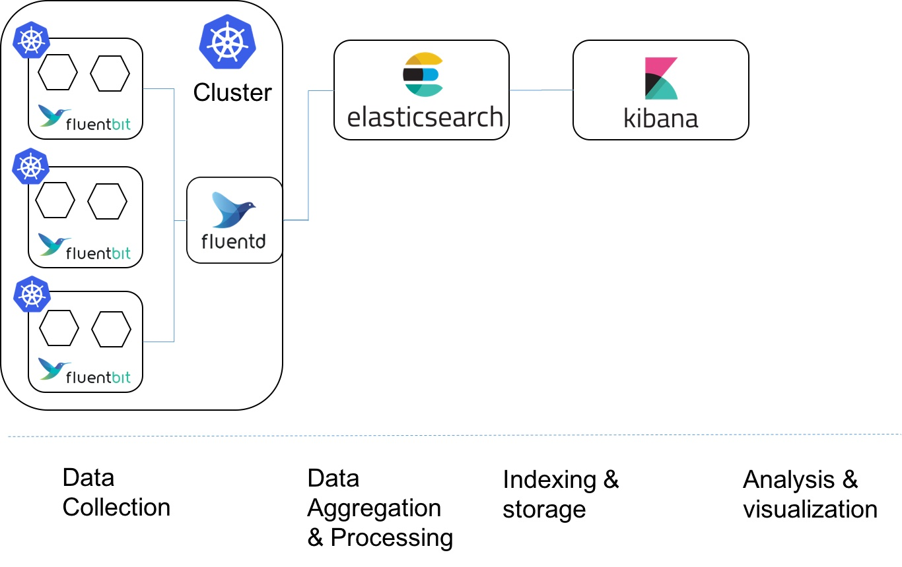

<h1>
    
    Kubernetes Fury Logging
</h1>


<!-- <KFD-DOCS> -->

**Kubernetes Fury Logging** provides a logging stack for the [Kubernetes Fury Distribution (KFD)][kfd-repo].

If you are new to KFD please refer to the [official documentation][kfd-docs] on how to get started with KFD.

## Overview

**Kubernetes Fury Logging** uses a collection of open source tools to provide the most resilient and robust logging stack for the cluster.

The central piece of the stack is the CNCF certified open source search engine [opensearch][opensearch-page], combined
with its analytics and visualization platform [opensearch-dashboards][opensearch-dashboards-page].
The logs are collected using a node-level data collection and enrichment agent [fluentbit][fluentbit-page](deployed as `Daemonsets`),
pushing it to the Opensearch via [fluentd][fluentd-page].

Following is a high level design diagram of the module:



All the components are deployed in the `logging` namespace in the cluster.

## Packages

The following packages are included in the Fury Kubernetes Logging katalog:

| Package                                                | Version  | Description                                                                                             |
|--------------------------------------------------------|----------|---------------------------------------------------------------------------------------------------------|
| [cerebro](katalog/cerebro)                             | `0.9.4`  | Web admin tool that helps you manage your Opensearch cluster via a graphical user interface             |
| [curator](katalog/curator)                             | `5.8.4`  | Manages opensearch indices and snapshots, along with configurations to set the retention log policies   |
| [curator-s3](katalog/curator-s3)                       | `5.8.4`  | `curator` with S3 compliant bucket support                                                              |
| [opensearch-single](katalog/opensearch-single)         | `1.2.4`  | Single node opensearch deployment                                                                       |
| [opensearch-triple](katalog/opensearch-triple)         | `1.2.4`  | Three node high-availability opensearch deployment                                                      |
| [opensearch-dashboards](katalog/opensearch-dashboards) | `1.2.0`  | Analytics and visualization platform for Opensearch                                                     |
| [logging-operator](katalog/logging-operator)           | `3.17.2` | Banzai logging operator, manages fluentbit/fluentd and their configurations                             |
| [logging-operated](katalog/logging-operated)           | `-`      | fluentd and fluentbit deployment using logging operator                                                 |
| [configs](katalog/configs)                             | `-`      | Logging pipeline configs to gather various types of logs                                                |

Click on each package to see its full documentation.

## Compatibility

| Kubernetes Version |   Compatibility    | Notes                                               |
|--------------------|:------------------:|-----------------------------------------------------|
| `1.20.x`           | :white_check_mark: | No known issues                                     |
| `1.21.x`           | :white_check_mark: | No known issues                                     |
| `1.22.x`           | :white_check_mark: | No known issues                                     |
| `1.23.x`           |     :warning:      | Conformance tests passed. Not officially supported. |

Check the [compatibility matrix][compatibility-matrix] for additional informations about previous releases of the modules.

## Usage

### Prerequisites

| Tool                        | Version   | Description                                                                                                                                                    |
|-----------------------------|-----------|----------------------------------------------------------------------------------------------------------------------------------------------------------------|
| [furyctl][furyctl-repo]     | `>=0.6.0` | The recommended tool to download and manage KFD modules and their packages. To learn more about `furyctl` read the [official documentation][furyctl-repo].     |
| [kustomize][kustomize-repo] | `>=3.5.0` | Packages are customized using `kustomize`. To learn how to create your customization layer with `kustomize`, please refer to the [repository][kustomize-repo]. |

### Deployment

1. List the packages you want to deploy and their version in a `Furyfile.yml`

```yaml
bases:
  - name: logging/cerebro
    version: "v3.0.0"
  - name: logging/curator
    version: "v3.0.0"
  - name: logging/opensearch-single
    version: "v3.0.0"
  - name: logging/opensearch-dashboards
    version: "v3.0.0"
  - name: logging/logging-operator
    version: "v3.0.0"
  - name: logging/logging-operated
    version: "v3.0.0"
  - name: logging/configs
    version: "v3.0.0"
  - name: logging/kibana
    version: "v3.0.0"
```

> See `furyctl` [documentation][furyctl-repo] for additional details about `Furyfile.yml` format.

2. Execute `furyctl vendor -H` to download the packages

3. Inspect the download packages under `./vendor/katalog/logging`.

4. Define a `kustomization.yaml` that includes the `./vendor/katalog/logging` directory as resource.

```yaml
resources:
- ./vendor/katalog/logging/cerebro
- ./vendor/katalog/logging/curator
- ./vendor/katalog/logging/opensearch-single
- ./vendor/katalog/logging/opensearch-dashboards
- ./vendor/katalog/logging/logging-operator
- ./vendor/katalog/logging/logging-operated
- ./vendor/katalog/logging/configs
```

5. To deploy the packages to your cluster, execute:

```bash
kustomize build . | kubectl apply -f -
```

### Common Customisations

#### Setup a high-availability three-node elasticsearch

Logging module offers an out of the box, highly-available setup for `opensearch` instead of a single node version. To set this up, in the `Furyfile` and `kustomization`, you can replace `opensearch-single` with `opensearch-triple`.

#### Setup curator with datastore in an s3 compliant bucket

To setup `curator` with `s3` compliant bucket support, we provide [`curator-s3`](katalog/curator-s3). To set it up, instead of `curator`, use `curator-s3` in `Furyfile` and `kustomization` in the above defined deployment step.

To configure the `s3` bucket, you will have to edit the file [`s3-curator-credentials.env`](katalog/curator-s3/s3-curator-credentials.env) with the following content, with the right configuration secrets:

```env
AWS_ACCESS_KEY_ID=AAAA
AWS_REGION=eu-west-1
AWS_SECRET_ACCESS_KEY=myKey
S3_BUCKET_NAME=my-s3_bucket
```

<!-- Links -->

[opensearch-page]: https://opensearch.org
[opensearch-dashboards-page]: https://opensearch.org
[fluentbit-page]: https://fluentbit.io/
[fluentd-page]: https://www.fluentd.org/
[kfd-repo]: https://github.com/sighupio/fury-distribution
[furyctl-repo]: https://github.com/sighupio/furyctl
[kustomize-repo]: https://github.com/kubernetes-sigs/kustomize
[kfd-docs]: https://docs.kubernetesfury.com/docs/distribution/
[compatibility-matrix]: https://github.com/sighupio/fury-kubernetes-logging/blob/master/docs/COMPATIBILITY_MATRIX.md

<!-- </KFD-DOCS> -->

<!-- <FOOTER> -->

## Contributing

Before contributing, please read first the [Contributing Guidelines](docs/CONTRIBUTING.md).

### Reporting Issues

In case you experience any problem with the module, please [open a new issue](https://github.com/sighupio/fury-kubernetes-logging/issues/new/choose).

## License

This module is open-source and it's released under the following [LICENSE](LICENSE)

<!-- </FOOTER> -->
