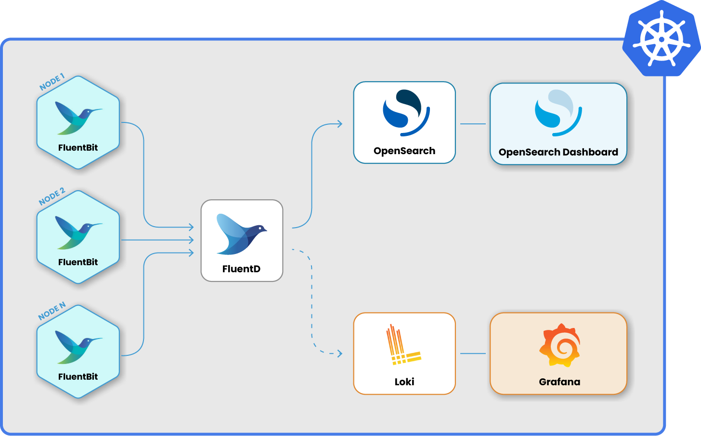

<!-- markdownlint-disable MD033 MD045 -->
<h1 align="center">
<picture>
  <source media="(prefers-color-scheme: dark)" srcset="https://raw.githubusercontent.com/sighupio/distribution/refs/heads/main/docs/assets/white-logo.png">
  <source media="(prefers-color-scheme: light)" srcset="https://raw.githubusercontent.com/sighupio/distribution/refs/heads/main/docs/assets/black-logo.png">
  
</picture><br/>
  Logging Module
</h1>
<!-- markdownlint-enable MD033 MD045 -->


<!-- <SD-DOCS> -->

**Logging Module** provides a logging stack for [SIGHUP Distribution (SD)][kfd-repo].

If you are new to SD please refer to the [official documentation][kfd-docs] on how to get started with SD.

## Overview

**Logging Module** uses a collection of open source tools to provide a resilient and robust logging stack for the cluster.

The central piece of the stack is the open source search engine [OpenSearch][opensearch-page], combined with its analytics and visualization platform [OpenSearch Dashboards][opensearch-dashboards-page]. Logs are collected by a node-level data collection and enrichment agent, [Fluent Bit][fluentbit-page], and pushed to OpenSearch through [Fluentd][fluentd-page]. The Fluent Bit and Fluentd stack is managed by the Logging Operator. [Loki][loki-page] is also available as an alternative log storage backend to OpenSearch.

All the components are deployed in the `logging` namespace in the cluster.

High-level diagram of the stack:



## Packages

The following packages are included in the Logging module:

| Package                                                | Version                        | Description                                                                          |
|--------------------------------------------------------|--------------------------------|--------------------------------------------------------------------------------------|
| [opensearch-single](katalog/opensearch-single)         | `v3.8.0`                       | Single node opensearch deployment. Not intended for production use.                  |
| [opensearch-triple](katalog/opensearch-triple)         | `v3.8.0`                       | Three node high-availability opensearch deployment                                   |
| [opensearch-dashboards](katalog/opensearch-dashboards) | `v3.8.0`                       | Analytics and visualization platform for Opensearch                                  |
| [logging-operator](katalog/logging-operator)           | `v6.8.0`                       | Banzai logging operator, manages fluentbit/fluentd and their configurations          |
| [logging-operated](katalog/logging-operated)           | `-`                            | fluentd and fluentbit deployment using logging operator                              |
| [configs](katalog/configs)                             | `-`                            | Logging pipeline configs to gather various types of logs and send them to OpenSearch |
| [loki-configs](katalog/loki-configs)                   | `-`                            | Logging pipeline configs to gather various types of logs and send them to Loki       |
| [loki-distributed](katalog/loki-distributed)           | `v3.7.7`                       | Distributed Loki deployment                                                          |
| [minio-ha](katalog/minio-ha)                           | `RELEASE.2026-07-17T12-07-51Z` | Three nodes HA MinIO deployment                                                      |

Click on each package to see its full documentation.

## Compatibility

| Kubernetes Version |   Compatibility    | Notes           |
|--------------------|:------------------:|-----------------|
| `1.33.x`           | :white_check_mark: | No known issues |
| `1.34.x`           | :white_check_mark: | No known issues |
| `1.35.x`           | :white_check_mark: | No known issues |
| `1.36.x`           | :white_check_mark: | No known issues |

Check the [compatibility matrix][compatibility-matrix] for additional information about previous releases of the modules.

## Usage

**Logging Module** is part of SIGHUP Distribution (SD) and is deployed automatically by [`furyctl`][furyctl-repo] when you create or update a cluster. You don't need to download, vendor or install its packages manually.

### Configuration

You configure the module under `spec.distribution.modules.logging` in your `furyctl.yaml`. The `type` field selects the logging stack to deploy: `opensearch`, `loki`, `customOutputs`, or `none` to disable the module. When using OpenSearch, `opensearch.type` selects a `single` or `triple` node deployment. The other fields are optional and fall back to sensible defaults.

```yaml
apiVersion: kfd.sighup.io/v1alpha2
kind: KFDDistribution
spec:
  distribution:
    modules:
      logging:
        type: opensearch
        opensearch:
          type: single
          storageSize: 150Gi
```

To use Loki as the log storage backend instead, set `type: loki` and choose the Loki storage backend with `loki.backend` (`minio` for an in-cluster MinIO deployment, or `externalEndpoint` for an external S3-compatible object storage):

```yaml
apiVersion: kfd.sighup.io/v1alpha2
kind: KFDDistribution
spec:
  distribution:
    modules:
      logging:
        type: loki
        loki:
          backend: minio
```

See the configuration reference for your cluster kind for the full list of available options: [EKSCluster][schema-reference-eks], [KFDDistribution][schema-reference-kfd] or [OnPremises][schema-reference-onprem].

To install SD from scratch, follow the [Getting started][getting-started] guide.

<!-- Links -->

[opensearch-page]: https://opensearch.org
[opensearch-dashboards-page]: https://opensearch.org
[fluentbit-page]: https://fluentbit.io/
[fluentd-page]: https://www.fluentd.org/
[loki-page]: https://grafana.com/oss/loki/
[kfd-repo]: https://github.com/sighupio/distribution
[furyctl-repo]: https://github.com/sighupio/furyctl
[kfd-docs]: https://docs.sighup.io/docs/distribution/
[schema-reference-eks]: https://docs.sighup.io/docs/reference/ekscluster#specdistributionmoduleslogging
[schema-reference-kfd]: https://docs.sighup.io/docs/reference/kfddistribution#specdistributionmoduleslogging
[schema-reference-onprem]: https://docs.sighup.io/docs/reference/onpremises#specdistributionmoduleslogging
[getting-started]: https://docs.sighup.io/docs/getting-started/
[compatibility-matrix]: https://github.com/sighupio/module-logging/blob/main/docs/COMPATIBILITY_MATRIX.md

<!-- </SD-DOCS> -->

<!-- <FOOTER> -->

## Contributing

Before contributing, please read first the [Contributing Guidelines](https://github.com/sighupio/distribution/blob/main/docs/CONTRIBUTING.md).

### Reporting Issues

In case you experience any problems with the module, please [open a new issue](https://github.com/sighupio/module-logging/issues/new/choose).

## License

This module is open-source, and it's released under the following [LICENSE](LICENSE)

<!-- </FOOTER> -->
