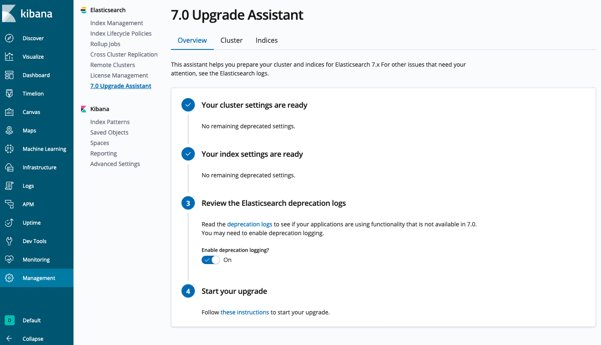
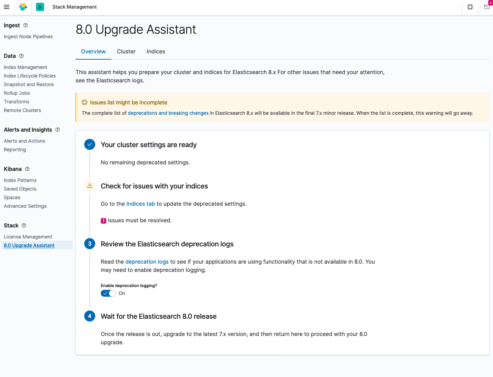
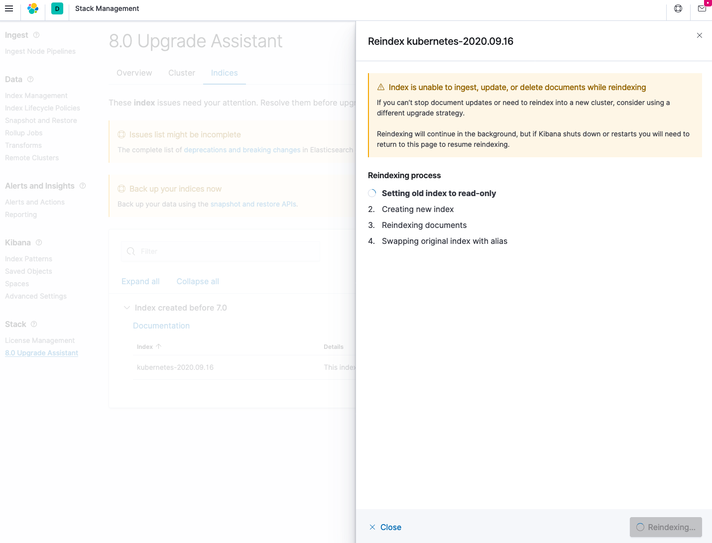
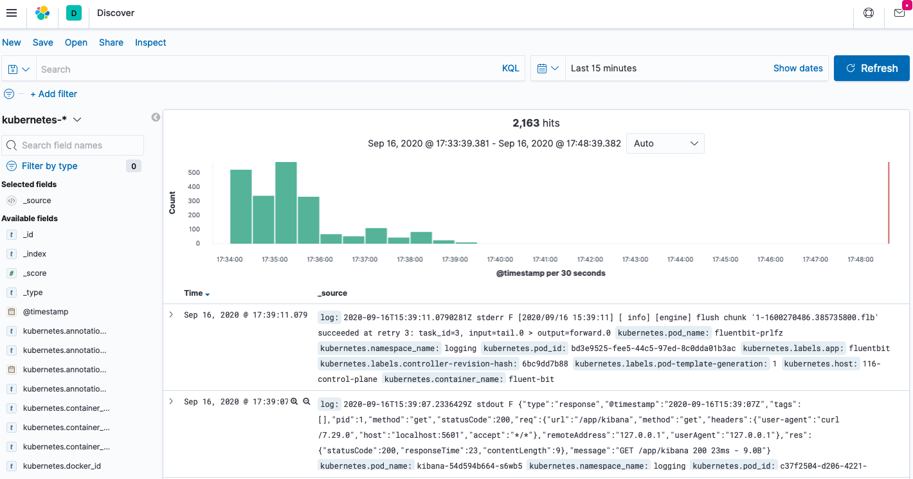

# Logging Core Module version 1.6.0

SIGHUP team maintains this module updated and tested. That is the main reason why we worked on this new release.
With the Kubernetes 1.19 release, it became the perfect time to start testing this module against this Kubernetes
release. During the latest release, 1.5.0, the team prepared the module to be easily updatable to the next major
ElasticSearch version: from 6 to 7. Other minor works have been done in this module updating Cerebro and the log
collector releases.

Continue reading the [Changelog](#changelog) to discover them:

## Changelog

- Update cerebro. From version `0.8.5` to `0.9.2`.
- Update fluentd. From version `1.10.2` to `1.11.2`.
- Update fluent-bit. From version `1.4.4` to `1.5.6`.
- Update elasticsearch. From version `6.8.8` to `7.9.1`
- Update kibana. From version `6.8.8` to `7.9.1`


## Upgrade path

To upgrade this core module from `v1.5.0` to `v1.6.0`, you need to download this new version, then apply the
`kustomize` project. No further action is required.

```bash
$ kustomize build katalog/cerebro | kubectl apply -f -
$ kustomize build katalog/elasticsearch-single | kubectl apply -f -
# or
$ kustomize build katalog/elasticsearch-triple | kubectl apply -f -
$ kustomize build katalog/fluentd | kubectl apply -f -
$ kustomize build katalog/kibana | kubectl apply -f -
```


### Important notes

Before upgrading the `elasticsearch-{single,triple}` and the `kibana` package we recommend to ensure you read and
understand the
[elastic rolling-upgrade official documentation](https://www.elastic.co/guide/en/elasticsearch/reference/7.9/rolling-upgrades.html).


Once read, be sure to check and follow these steps:

**VERY IMPORTANT NOTE:** *Be sure to have a recent backup of the elasticsearch indexes.*

Then, navigate to the Kibana dashboard, check the requirements to upgrade to the 7.X version. Do any action until you
see the state ready to perform the upgrade:



Once you have your elasticsearch cluster ready, apply the `kustomize` project for `elasticsearch` and `kibana`.

*It can take some minutes (depending on the number of documents, indexes, and replicas)*.

```bash
$ kustomize build katalog/elasticsearch-single | kubectl apply -f -
# or
$ kustomize build katalog/elasticsearch-triple | kubectl apply -f -
$ kustomize build katalog/kibana | kubectl apply -f -
```

Finally, once the new release is ready, visit again the (new) Kibana dashboard to check requirements to upgrade
to the 8.X version. 



Then, reindex all old indexes that were created with the previous 6.X version:



That's all!


