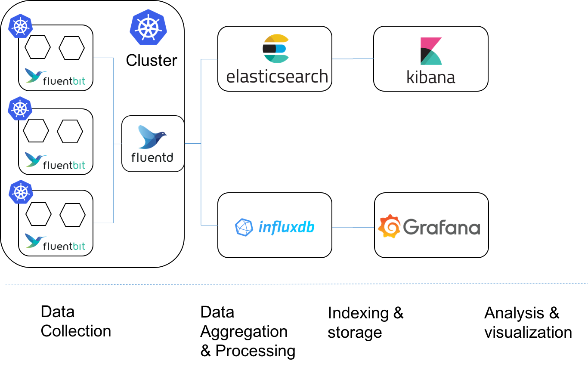

# Fluentd & Fluent-bit

Fluentd is an open-source data collector for unified logging that can store
collected data in various destinations. Fluentd deployment in Fury Kubernetes
Logging is configured to write records into Elasticsearch.

Fluent Bit is an open-source and multi-platform Log Processor and Forwarder which allows you to collect data/logs from different sources,
unify and send them to multiple destinations. In our case Fluent Bit sends logs to Fluentd instances.



## Requirements

- Kubernetes >= `1.18.0`
- Kustomize >= `v3`
- [prometheus-operator](https://github.com/sighup-io/fury-kubernetes-monitoring/blob/master/prometheus-operator)


## Image repository and tag

* Fluentd image: `quay.io/sighup/fluentd-elasticsearch:v1.12.3-debian-1.0`
* Fluentd repo: [https://github.com/fluent/fluentd](https://github.com/fluent/fluentd)
* Fluentd documentation:
[https://docs.fluentd.org/quickstart](https://docs.fluentd.org/quickstart)
* Fluent-bit image: `fluent/fluent-bit:1.8.2`
* Fluent-bit repo: [https://github.com/fluent/fluent-bit](https://github.com/fluent/fluent-bit)
* Fluent-bit documentation: [https://docs.fluentbit.io/manual/](https://docs.fluentbit.io/manual/)


## Configuration

- Listens on port `24231`
- Resource limits are `1000m` for CPU and `400Mi` for memory
- Configured to send log data to Elasticsearch
- Metrics are scraped every `30s` by Prometheus
- Integrates with [elasticsearch-single](../elasticsearch-single) and
  [elasticsearch-triple](../elasticsearch-triple)


## Deployment

You can deploy fluentd by running the following command in the root of the project:

```shell
kustomize build | kubectl apply -f -
```


## License

For license details please see [LICENSE](../../LICENSE)
